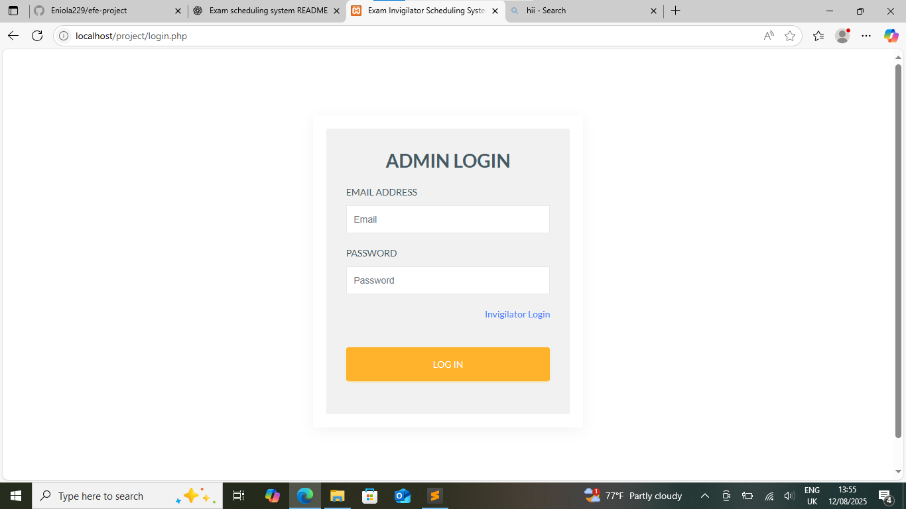
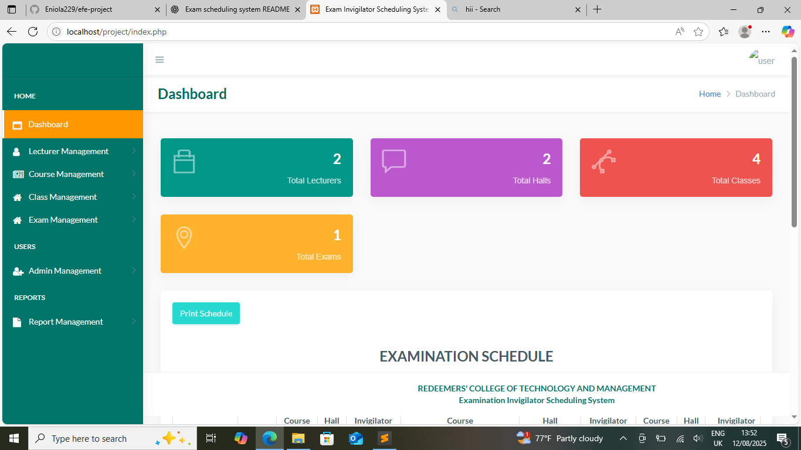
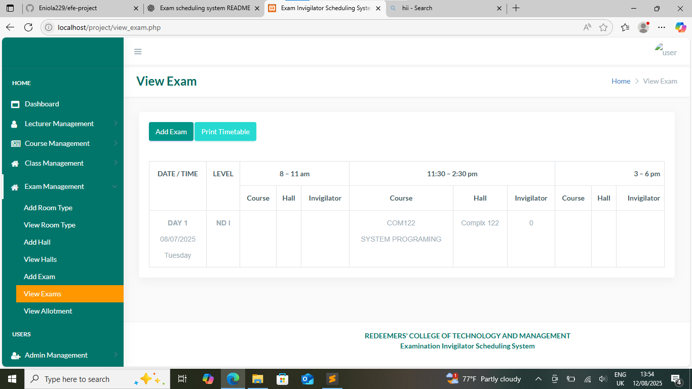

# 📅 Examination Invigilator Scheduling System

A **web-based system** built using **PHP**, **MySQL**, and **Bootstrap** for managing and scheduling **invigilators** for examinations.  
It allows administrators to create exam schedules, assign invigilators, and ensure there are no conflicts in duties.

---

## 🚀 Features

- **Admin Dashboard** for managing exams, venues, and invigilator assignments.
- **Invigilator Management** — add, edit, and remove invigilator profiles.
- **Exam Scheduling** with automatic conflict detection.
- **Duty Assignment** — assign invigilators to specific exams and rooms.
- **Responsive Design** powered by Bootstrap.
- **Role-based Access** (Admin & Invigilator).
- **Search & Filter** to quickly locate schedules.
- **Printable & Exportable Duty Roster**.

---

## 🛠️ Technologies Used

- **Frontend:** HTML, CSS, JavaScript, Bootstrap 5
- **Backend:** PHP (Procedural or OOP — specify which you used)
- **Database:** MySQL
- **Server:** Apache (XAMPP / WAMP / LAMP)

---

## 📂 Project Structure

```
invigilator-scheduling-system/
│
├── config/           # Database configuration
├── assets/           # CSS, JS, images
├── views/            # HTML/PHP pages
├── includes/         # Reusable components (header, footer, nav)
├── admin/            # Admin-specific pages
├── invigilator/      # Invigilator-specific pages
└── index.php         # Main entry point
```

---

## ⚙️ Installation & Setup

1. **Clone the repository**
   ```bash
   git clone https://github.com/your-username/invigilator-scheduling-system.git
   ```

2. **Move to your server directory** (XAMPP’s `htdocs`, WAMP’s `www`, etc.)
   ```bash
   mv invigilator-scheduling-system /path/to/htdocs
   ```

3. **Import the database**
   - Open **phpMyAdmin**
   - Create a new database, e.g., `invigilator_db`
   - Import the `invigilator_db.sql` file from the project’s `database/` folder.

4. **Configure database connection**
   - Edit `config/db.php` (or whichever file stores DB credentials)
   - Update:
     ```php
     $host = "localhost";
     $user = "root";
     $pass = "";
     $dbname = "invigilator_db";
     ```

5. **Run the application**
   - Open browser and go to:
     ```
     http://localhost/invigilator-scheduling-system
     ```

---

## 🔑 Default Login Credentials

**Admin**
```
Username: admin
Password: admin123
```

**Invigilator**
```
Username: invigilator
Password: invigilator123
```

*(Change these after first login for security.)*

---

## 📸 Screenshots

**Login Page**


**Admin Dashboard**


**Invigilator Duty Roster**


---

## 📜 License

This project is licensed under the **MIT License** — you are free to modify and distribute it.

---

## ✨ Author

**Efe**  
📧 efebotore@gmail.com  
🔗 [GitHub Profile](https://github.com/efe221)
